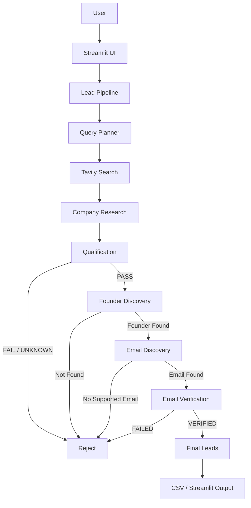

# TVB Agentic Lead Discovery

An evidence-first, agentic lead discovery platform built for the **The Venture Build (TVB)** use case.

The system dynamically discovers technology companies, researches them, validates qualification criteria, identifies a CEO/founder, discovers an explicitly supported professional email, verifies the email, and returns only leads that pass all required gates.

---

## Features

- Dynamic company discovery using live web search
- Agentic search-query planning
- Company research and structured extraction
- Financial qualification
- Technology/platform qualification
- Geographic qualification
- Founder / CEO discovery
- Public professional email discovery
- Email syntax and DNS/MX verification
- Evidence-first validation
- Groq rate-limit fallback
- Duplicate filtering
- Demo / Mock Mode
- Live Agent Mode
- CSV export
- Streamlit web interface
- Automated test suite

---

## Pipeline

```text
User
  |
  v
Streamlit UI
  |
  v
Lead Pipeline
  |
  +--> Query Planner
  |
  +--> Tavily Web Discovery
  |
  +--> Company Research
  |
  +--> Qualification
  |       |
  |       +--> Financial
  |       +--> Technology
  |       +--> Geography
  |
  +--> Founder / CEO Discovery
  |
  +--> Email Discovery
  |
  +--> Email Verification
  |
  v
Final Verified Leads
```

The pipeline follows:

```text
DISCOVER
   ->
RESEARCH
   ->
QUALIFY
   ->
FIND FOUNDER
   ->
FIND EXPLICIT EMAIL
   ->
VERIFY
   ->
FINAL LEAD
```

---

## Target Lead Criteria

A company should satisfy all of the following requirements.

### 1. Financial

The company must have either:

- Funding between **$1M and $5M USD**, inclusive
- OR annual revenue / ARR between **$1M and $5M USD**, inclusive

```text
$1M <= Funding/Revenue <= $5M USD
```

Examples:

```text
$2M USD  -> PASS
$5M USD  -> PASS
$1M USD  -> PASS
$800K    -> FAIL
$7M      -> FAIL
```

Currencies such as EUR or GBP are not silently converted.

```text
EUR/GBP amount without supported USD conversion -> UNKNOWN
```

---

### 2. Technology

The company must operate a genuine technology product or platform.

Examples:

- SaaS
- B2B software
- AI/ML platform
- Data platform
- Cloud infrastructure
- Developer tools
- API platform
- Automation platform
- Fintech infrastructure
- Cybersecurity platform
- Digital platform

Consulting-only or service-only companies should not qualify.

---

### 3. Geography

The company should be primarily based outside the United States.

The system looks for evidence such as:

```text
Headquartered in ...
Based in ...
HQ in ...
Operations in ...
Office in ...
```

A US investor, US customer, or US media article does not automatically mean that the company is US-based.

---

### 4. Founder / CEO

The final lead must have an identified:

- CEO
- Founder
- Co-founder

The person's identity and role must be supported by public evidence.

---

### 5. Professional Email

The final lead must have an explicitly published professional email.

The system does NOT guess emails.

It will not automatically create:

```text
firstname@company.com
first.last@company.com
```

Generic addresses such as:

```text
info@
support@
hello@
contact@
```

are not treated as founder contact information.

Third-party fundraising or contact-service emails are rejected when they do not belong to the company.

---

### 6. Verification

The email must pass:

- Syntax validation
- Domain validation
- DNS/MX validation
- Founder/email association validation

The system does not perform invasive SMTP mailbox probing.

---

# Architecture



---

# Pipeline Stages

## 1. Discovery

The planner dynamically creates company-search queries based on:

- Sector
- Geography
- Funding/revenue signals
- Technology keywords
- Startup/company terminology

Tavily executes the queries against the live web.

The system filters obvious non-company results such as:

- Funding lists
- Industry reports
- General articles
- VC pages
- Irrelevant social-media posts
- Other non-company pages

No fixed company list is used.

---

## 2. Research

The research service converts search results into structured company profiles.

It attempts to extract:

```text
Company Name
Website
Industry
Description
Location
Funding
Funding Currency
Revenue / ARR
Evidence
Source URLs
```

### Hybrid Research

Groq is used when available, but deterministic extraction is also available.

```text
Tavily Evidence
      |
      +--> Webpage Content
      |
      v
Evidence Extraction
      |
      +--> Deterministic Recovery
      |
      +--> Groq Enhancement
      |
      v
Company Profile
```

This prevents the entire research stage from stopping when Groq is temporarily unavailable or rate-limited.

---

## 3. Qualification

Three major gates are evaluated:

```text
Financial
Technology
Geography
```

Each gate returns:

```text
PASS
FAIL
UNKNOWN
```

A company is qualified only when:

```text
Financial  = PASS
Technology = PASS
Geography  = PASS
```

Missing evidence is not treated as a pass.

---

## 4. Founder Discovery

Founder discovery runs only for qualified companies.

The service searches for:

- CEO
- Founder
- Co-founder
- Leadership information

The person's name and role are validated before the result is passed to the email stage.

Malformed results such as:

```text
CTO of CompanyJohn Doe
```

are rejected.

---

## 5. Email Discovery

The service searches specifically for the identified founder.

Example search patterns:

```text
"Jane Doe" "Example Technologies" email
"Jane Doe" "@example.com"
"Jane Doe" CEO email
site:example.com "Jane Doe" email
```

Potential sources include:

- Company websites
- Press releases
- Interviews
- Conference profiles
- Public professional profiles
- Public articles

The system does not generate an email address from a naming pattern.

---

## 6. Email Verification

The verification flow is:

```text
Email
  |
  +--> Syntax
  |
  +--> Domain
  |
  +--> DNS / MX
  |
  +--> Founder Association
  |
  v
VERIFIED
```

`VERIFIED` means that the email has valid syntax, uses a valid domain, has mail infrastructure, and is supported by evidence as associated with the founder/CEO.

It does not guarantee that a specific mailbox is active.

---

# Agentic Behavior

The system behaves as a bounded agentic pipeline.

It can:

1. Plan search queries
2. Rotate sectors and geographic targets
3. Search the live web
4. Filter irrelevant results
5. Research companies
6. Evaluate qualification gates
7. Discover founders
8. Discover public emails
9. Verify emails
10. Continue searching until the target or configured limits are reached

Execution is bounded by:

```text
Target Leads
Max Iterations
Max Candidates
```

---

# Rate-Limit Resilience

API usage is controlled through bounded execution.

The research service uses a hybrid strategy:

### Groq Available

```text
Tavily
  ->
Evidence
  ->
Groq
  ->
Structured Profile
```

### Groq Unavailable / Rate Limited

```text
Tavily
  ->
Evidence
  ->
Deterministic Extraction
  ->
Structured Profile
```

The system therefore does not depend completely on the LLM for basic evidence extraction.

However, it still refuses to guess information that cannot be supported.

---

# Evidence-First Design

The project is designed to minimize hallucinations and false leads.

## No Unsupported Financial Data

If a source says:

```text
€3M funding
```

the system does not automatically change it to:

```text
$3M funding
```

---

## No Guessed Emails

The system does not infer:

```text
john.smith@company.com
```

only because the founder's name is John Smith.

---

## No Malformed Founder Names

The system validates extracted person names before accepting them.

---

## No Unrelated Third-Party Emails

For example:

```text
Company: Example.ai
Founder: John Smith
Email: support@fundraising-service.com
```

is not treated as a valid founder email.

When the company domain is known, the email domain is checked for compatibility.

---

## UNKNOWN Is Safer Than Guessing

When evidence is insufficient:

```text
UNKNOWN
```

is returned.

This improves lead precision.

---

# Technology Stack

| Technology | Purpose |
|---|---|
| Python | Application development |
| Streamlit | Web interface |
| Groq | Agentic planning and optional extraction |
| Tavily | Dynamic web search |
| Pydantic | Data validation |
| HTTPX | Web requests |
| BeautifulSoup | HTML parsing |
| dnspython | DNS/MX verification |
| Pandas | Data processing and CSV output |
| Pytest | Automated testing |

---

# Project Structure

```text
TVB-Agentic-Lead-Discovery/
|
+-- app.py
+-- README.md
+-- requirements.txt
+-- .env.example
+-- .gitignore
|
+-- agent/
|   +-- __init__.py
|   +-- planner.py
|   +-- lead_pipeline.py
|
+-- core/
|   +-- __init__.py
|   +-- models.py
|   +-- validation_models.py
|   +-- founder_models.py
|   +-- email_models.py
|   +-- lead_models.py
|
+-- services/
|   +-- __init__.py
|   +-- search_service.py
|   +-- company_research_service.py
|   +-- qualification_service.py
|   +-- founder_discovery_service.py
|   +-- email_discovery_service.py
|   +-- email_verification_service.py
|   +-- mock_pipeline.py
|
+-- tests/
|   +-- test_company_research_service.py
|   +-- test_qualification_service.py
|   +-- test_founder_discovery_service.py
|   +-- test_email_services.py
|   +-- test_mock_pipeline.py
|   +-- test_lead_pipeline.py
|   +-- test_performance.py
|
+-- data/
    +-- .gitkeep
```

---

# Setup

## Prerequisites

Install:

- Python 3.10+
- Git
- Internet connection for Live Agent Mode

Python 3.11+ is recommended.

---

## Clone

```bash
git clone https://github.com/charanreddy0006/tvb-agentic-lead-discovery.git
cd tvb-agentic-lead-discovery
```

---

## Create Virtual Environment

### Windows PowerShell

```powershell
python -m venv .venv
.\.venv\Scripts\Activate.ps1
```

### macOS / Linux

```bash
python3 -m venv .venv
source .venv/bin/activate
```

---

## Install Dependencies

```bash
pip install -r requirements.txt
```

---

# Environment Variables

Create `.env` from `.env.example`.

### Windows PowerShell

```powershell
Copy-Item .env.example .env
```

Add:

```env
GROQ_API_KEY=your_groq_api_key
TAVILY_API_KEY=your_tavily_api_key
GROQ_MODEL=openai/gpt-oss-20b
```

Never commit the real `.env` file.

---

# Running the Application

Start the application:

```bash
streamlit run app.py
```

The Streamlit dashboard will open in the browser.

---

# Demo / Mock Mode

Demo / Mock Mode is useful for:

- Testing
- UI demonstrations
- Evaluator walkthroughs
- Development without API credits

Flow:

```text
Mock Discovery
     ->
Mock Research
     ->
Mock Qualification
     ->
Mock Founder
     ->
Mock Email
     ->
Mock Verification
     ->
Final Lead
```

---

# Live Agent Mode

Live Agent Mode uses the actual Groq and Tavily services.

Recommended assignment configuration:

```text
Target Leads   = 15
Max Iterations = 5
Max Candidates = 75
Execution Mode = Live Agent
```

Click:

```text
Discover Qualified Leads
```

to start the run.

---

# Output

The Streamlit dashboard displays:

```text
Companies Discovered
Companies Researched
Qualified Companies
Founders Found
Emails Discovered
Verified Emails
Final Leads
```

The final table contains information such as:

| Field | Description |
|---|---|
| Company | Qualified company |
| Industry | Technology/product category |
| Location | Company location |
| Founder / CEO | Identified founder or CEO |
| Role | CEO / Founder / Co-founder |
| Verified Email | Explicitly supported email |
| Funding | Supported funding |
| Revenue | Supported revenue / ARR |
| Verification | Verification result |

The application also provides CSV download.

---

# Testing

Run:

```bash
python -m pytest -q
```

The tests cover:

- Company research
- Financial extraction
- Geographic validation
- Technology validation
- Founder discovery
- Email discovery
- Email verification
- Mock pipeline
- Lead pipeline
- Performance
- Rate-limit fallback behavior

The current project has been validated with the automated test suite.

---

# Security

## API Keys

Never commit:

```text
.env
API keys
Access tokens
Credentials
```

Use:

```text
.env.example
```

as the safe template.

---

## Email Safety

The application:

- Does not guess founder emails
- Does not send emails
- Does not log into mailboxes
- Does not perform invasive SMTP probing
- Uses public evidence
- Uses DNS/MX checks

---

# Limitations

## Search Results

Some websites may:

- Block automated requests
- Return HTTP 403
- Require JavaScript
- Provide incomplete content
- Contain outdated information

The system uses available snippets and fallback extraction where possible.

---

## API Limits

Groq and Tavily are subject to account/provider limits.

The application reduces usage through:

- Bounded iterations
- Candidate limits
- Query limits
- Deterministic extraction
- Fallback logic

---

## Email Verification

DNS/MX verification confirms mail infrastructure.

It does not prove that:

```text
Mailbox exists
Mailbox is active
Person will read the email
```

---

## Lead Yield

The target is:

```text
15 verified leads
```

The system does not fabricate leads to reach the target.

The final count can be lower if suitable companies or public evidence are unavailable.

---

# Deployment

The application can be deployed using Streamlit Community Cloud or another Python-compatible hosting platform.

## GitHub Repository

```text
https://github.com/charanreddy0006/tvb-agentic-lead-discovery
```

## Live Streamlit Application

```text
https://tvb-agentic-lead-discovery-buaxwhypwurteyqmrpr8vu.streamlit.app/
```

For deployment, configure secrets through the hosting platform.

Example:

```toml
GROQ_API_KEY = "your_groq_api_key"
TAVILY_API_KEY = "your_tavily_api_key"
GROQ_MODEL = "openai/gpt-oss-20b"
```

Never commit real credentials.

---

# Example

A hypothetical company:

```text
Company: Example AI
Location: Singapore
Funding: $3M USD
Industry: AI / SaaS
Founder: Jane Doe
Role: Co-founder & CEO
Email: jane@example.ai
```

### Discovery

Tavily discovers the company through a public source.

```text
Company discovered
```

### Research

```text
Funding   = $3M USD
Location  = Singapore
Technology = AI / SaaS
```

### Qualification

```text
Financial   = PASS
Technology  = PASS
Geography   = PASS
```

Result:

```text
QUALIFIED
```

### Founder

```text
Jane Doe
Co-founder & CEO
```

### Email

```text
jane@example.ai
```

### Verification

```text
Syntax      = PASS
MX          = PASS
Association = PASS
```

Result:

```text
VERIFIED
```

### Final Lead

```text
Example AI
Singapore
Jane Doe
Co-founder & CEO
jane@example.ai
$3M USD
VERIFIED
```

---

# Evaluation Checklist

The project includes:

- [x] Dynamic company discovery
- [x] Web-based research
- [x] Financial qualification
- [x] Technology qualification
- [x] Geographic qualification
- [x] Founder / CEO discovery
- [x] Public professional email discovery
- [x] Email verification
- [x] Evidence-backed validation
- [x] No guessed founder emails
- [x] No static company list
- [x] Bounded agentic execution
- [x] Demo / Mock Mode
- [x] Live Agent Mode
- [x] Streamlit interface
- [x] CSV output
- [x] Automated tests
- [x] GitHub repository
- [x] Public Streamlit deployment

### Target

```text
15 verified leads
```

The system attempts to reach this target without compromising validation quality.

---

# Design Principles

## Evidence First

Important decisions should be supported by public evidence.

## Precision Over Volume

A smaller number of accurate leads is better than a larger list containing false information.

## No Hallucinated Contacts

Founder names and emails are not invented.

## Dynamic Discovery

Companies are discovered through live search rather than a hardcoded list.

## Bounded Autonomy

The agent can search and continue iterating, but execution is controlled by explicit limits.

---

# Future Improvements

Potential improvements include:

- Multiple LLM providers
- Multiple search providers
- Better source ranking
- Improved company-domain discovery
- Trusted currency conversion
- Stronger deduplication
- Persistent lead database
- Scheduled discovery
- Lead scoring
- Better source citation UI
- Production monitoring
- Advanced analytics

---

# Conclusion

**TVB Agentic Lead Discovery** combines dynamic web search, agentic planning, structured research, qualification, founder discovery, email discovery, and verification into one bounded workflow.

The system is designed to avoid:

```text
Static Lists
False Company Matches
Unsupported Funding Claims
Wrong Geography
Incorrect Founder Identity
Guessed Emails
Generic Inboxes
Third-Party Contact Emails
Unverified Leads
```

Instead, it follows:

```text
DISCOVER
   ->
RESEARCH
   ->
QUALIFY
   ->
FIND FOUNDER
   ->
FIND EXPLICIT EMAIL
   ->
VERIFY
   ->
FINAL LEAD
```

The result is an evidence-backed lead rather than simply a company found through a web search.

---

# Project Links

## GitHub

```text
https://tvb-agentic-lead-discovery-buaxwhypwurteyqmrpr8vu.streamlit.app/
```

## Live Application

```text
https://tvb-agentic-lead-discovery-buaxwhypwurteyqmrpr8vu.streamlit.app/
```

---

**TVB Agentic Lead Discovery**

**Discover • Qualify • Verify**
