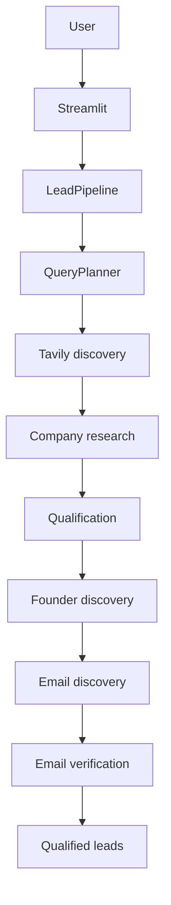

# TVB Agentic Company Lead Discovery

An autonomous agent designed to discover, evaluate, and verify high-potential technology platform companies matching **The Venture Build (TVB)** target investment and venture acceleration profile.

> **Project Status**: Steps 1-9 are implemented. Step 10 final QA hardens final-lead gating, deduplication, bounded discovery, and local Demo Mode validation. No live 15-lead run has been performed.

## Overview

TVB Agentic Lead Discovery is an evidence-first research application for finding technology companies that fit TVB's target profile, validating their business, identifying a CEO or founder, and returning only leads with an explicitly sourced and verified professional email.

### Problem

Finding suitable companies and trustworthy founder contact information requires several research steps. Unverified financial claims, guessed identities, generic inboxes, and incomplete email checks can create unusable or misleading lead lists.

### Solution

The application combines dynamic web discovery, structured company research, deterministic qualification, evidence-backed founder discovery, source-backed email discovery, and non-invasive email verification. Every final lead retains source URLs and supporting evidence for inspection.

## Architecture



### Technology Stack

- Python 3.10+
- Streamlit for the local dashboard
- Groq for dynamic query generation and structured extraction
- Tavily for web search
- Pydantic for validated data models
- HTTPX and BeautifulSoup for source retrieval and parsing
- dnspython for non-invasive MX checks

## Pipeline Flow

`QueryPlanner -> TavilySearchService -> CompanyResearchService -> QualificationService -> FounderDiscoveryService -> EmailDiscoveryService -> EmailVerificationService -> QualifiedLead`

The autonomous loop is bounded by `target_leads`, `max_iterations`, and `max_candidates`. It continues searching until the requested number of final verified leads is reached or a configured limit is exhausted. Real-world yield depends on available search results and source evidence; the project has not demonstrated 15 real verified leads yet.

### Email Discovery and Email Verification

Email Discovery accepts only an address explicitly associated with the evidenced founder or CEO in a public source. It does not construct or guess addresses and rejects generic inboxes. Email Verification checks syntax, DNS/MX infrastructure, and explicit founder association without SMTP mailbox probing.

## Step 4: Company Qualification & Validation

Step 4 evaluates each Step 3 `CompanyProfile` with deterministic, evidence-first rules. A company is qualified only when all criteria are `PASS`; a `FAIL` or `UNKNOWN` on any criterion means it is not qualified yet.

- **Financial:** Explicit funding or explicitly annual revenue/ARR must be between $1M and $5M USD, inclusive. Non-USD amounts remain in their original currency and are `UNKNOWN` until a verified conversion exists; no exchange rates are inferred.
- **Technology:** The description, industry, or preserved evidence must show that the company sells a genuine software, SaaS, API, or platform product. Consulting/services wording alone does not pass.
- **Geographic:** A known non-US headquarters can pass when no significant US operations are evidenced. US investors, customers, or press coverage do not themselves fail the check.
- **Evidence:** Every pass retains supporting profile evidence and source URLs. Missing or ambiguous evidence results in `UNKNOWN`, never a fabricated pass.

Run the live Step 4 demo with:

```bash
python -m services.qualification_service
```

## Step 5: Founder Discovery

Only companies that still pass all Step 4 checks proceed to founder research. Step 5 uses dynamic Tavily searches and Groq extraction to find one explicitly evidenced CEO or founder/co-founder. It preserves the supporting source URL and verbatim evidence, validates the role, and never guesses identity details. Results are `FOUND`, `NOT_FOUND`, or `UNCERTAIN` when evidence is insufficient or conflicting.

Run the live Step 5 demo with:

```bash
python -m services.founder_discovery_service
```

## Steps 6-8: Email and Autonomous Lead Pipeline

The bounded pipeline is: **Company -> Qualification -> Founder -> Email -> Verification -> Final Lead**. Emails are never generated or guessed. A final lead requires a Step 4-qualified company, an evidence-backed CEO/founder, an explicitly sourced professional email, and safe verification by syntax, DNS/MX, and explicit founder association.

Run a credit-safe development pass:

```bash
python -m agent.lead_pipeline --target-leads 1 --max-iterations 3 --max-candidates 30
```

For the assignment target, set `--target-leads 15`. `max_iterations` and `max_candidates` bound API use and prevent uncontrolled searching. Only final verified leads are exported locally to `data/final_leads.csv`, which is ignored by Git.

## Step 9: Streamlit Interface

Run the local product interface with:

```bash
streamlit run app.py
```

### 6. Run Tests

```bash
python -m unittest discover -s tests -v
```

### 7. Configure a Run

The Streamlit sidebar controls `Target Leads`, `Max Iterations`, `Max Candidates`, and `Execution Mode`. Demo Mode is intended for UI development and evaluation without external calls. Live Agent Mode requires configured Groq and Tavily credentials and runs only after the user clicks the discovery button.

## Security and Data Handling

- Copy `.env.example` to `.env`; never commit `.env` or API keys.
- `.env.*` is ignored except for the placeholder `.env.example`.
- Generated CSV and JSON files under `data/` are ignored.
- Demo companies exist only in `services/mock_pipeline.py` and are clearly labelled.
- Real lead output is written locally only when explicitly exported.
- Email verification uses syntax, MX infrastructure, and explicit founder association; it does not use SMTP mailbox probing.

## Limitations

- A live 15-lead run has not been performed because API credits are limited.
- Search and source quality determine how many companies pass all gates.
- MX validation confirms mail infrastructure, not mailbox deliverability.
- The application is locally runnable; public hosting and production credential management are not included.

The default **Demo / Mock Mode** uses clearly labelled fictional data and makes no Groq, Tavily, DNS, or other external calls. It demonstrates final-lead metrics, rejection analytics, evidence inspection, and in-memory CSV download.

**Live Agent Mode** is manually triggered only after configuration. It uses the existing bounded `LeadPipeline` with configurable target leads, maximum iterations, and maximum candidates. Emails are never generated or guessed; the final table and CSV contain only leads with a verified, evidence-backed founder/CEO email.

The default Demo Mode is fictional, deterministic, and local-only. Live Mode uses the real pipeline only after the user explicitly clicks the discovery button and requires configured Groq and Tavily credentials. API keys are never displayed in the UI.

## Step 10: Final QA and Production Hardening

The final gate requires a qualified company, an evidence-backed CEO/founder/co-founder, a source-backed founder email, and `VERIFIED` email status. Contradictory founder evidence is marked uncertain; duplicate companies, queries, source URLs, and founder/email pairs are suppressed within a bounded run. No external API calls are made by Demo Mode, and no live discovery run is performed automatically.

---

## 🎯 Target Company Parameters

1. **Funding / Revenue**: Between **$1,000,000 and $5,000,000 USD** (Seed, Late Seed, or Pre-Series A).
2. **Platform Nature**: Operates a **technology-related platform** (SaaS, Cloud Infrastructure, Developer Tools, B2B software, Data Orchestration, AI/ML).
3. **Geographic Focus**: **Minimal to no presence in the US** (HQ and core operations outside the United States, e.g., Europe, UK, India, Southeast Asia, MENA, LATAM).
4. **Verified Leadership**: Identifies **CEO or Co-founder** with a **verified professional email**.
5. **Autonomy**: Discovers sources and leads dynamically without static or hardcoded company lists.
6. **Zero Hallucination**: Unverified or unsupported fields are intentionally left blank rather than filled with fabricated data.
7. **Target Output**: Targets a minimum of **15 leads** matching all criteria with evidence links; this target has not yet been proven in a live run.

---

## 📁 Project Structure

```
TVB-Agentic-Lead-Discovery/
│
├── app.py                  # Streamlit dashboard and evaluator interface
├── requirements.txt        # Pinned initial project dependencies
├── .env.example            # Environment configuration template
├── .gitignore              # Git ignore rules for secrets, cache, and venv
├── README.md               # Project documentation
│
├── agent/                  # Orchestration, planning, and agent state
│   └── __init__.py
│
├── services/               # Search, scraping, extraction, email verification
│   └── __init__.py
│
├── core/                   # Shared configurations, Pydantic schemas, state
│   └── __init__.py
│
└── data/                   # Output storage for verified lead datasets
    └── .gitkeep
```

---

## 🚀 Quickstart & Setup

### 1. Prerequisites

- Python 3.10+ (Tested on Python 3.11)
- Git

### 2. Create and Activate Virtual Environment

**Windows (PowerShell):**

```powershell
python -m venv .venv
.\.venv\Scripts\Activate.ps1
```

**macOS / Linux:**

```bash
python3 -m venv .venv
source .venv/bin/activate
```

### 3. Install Dependencies

```bash
pip install -r requirements.txt
```

### 4. Configure Environment Variables

Copy `.env.example` to `.env` and fill in your API credentials:

```bash
cp .env.example .env
```

### 5. Run the Streamlit Application

```bash
streamlit run app.py
```
